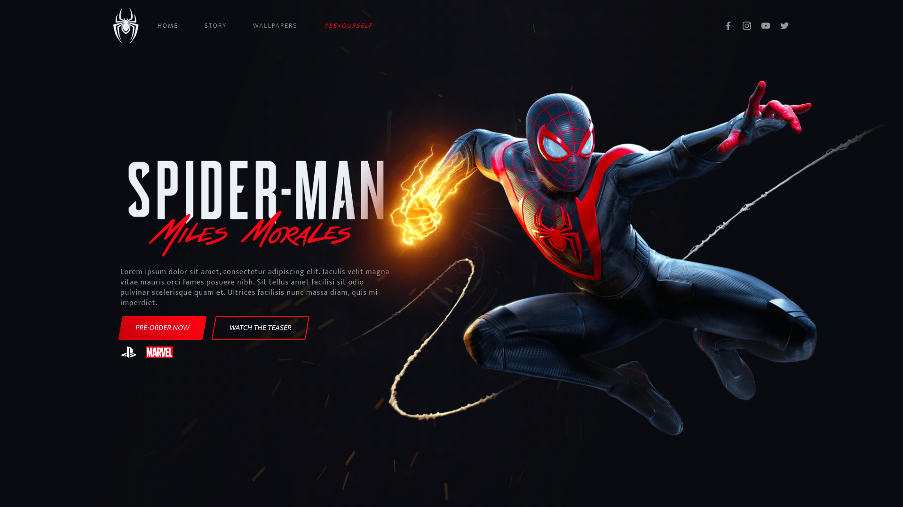
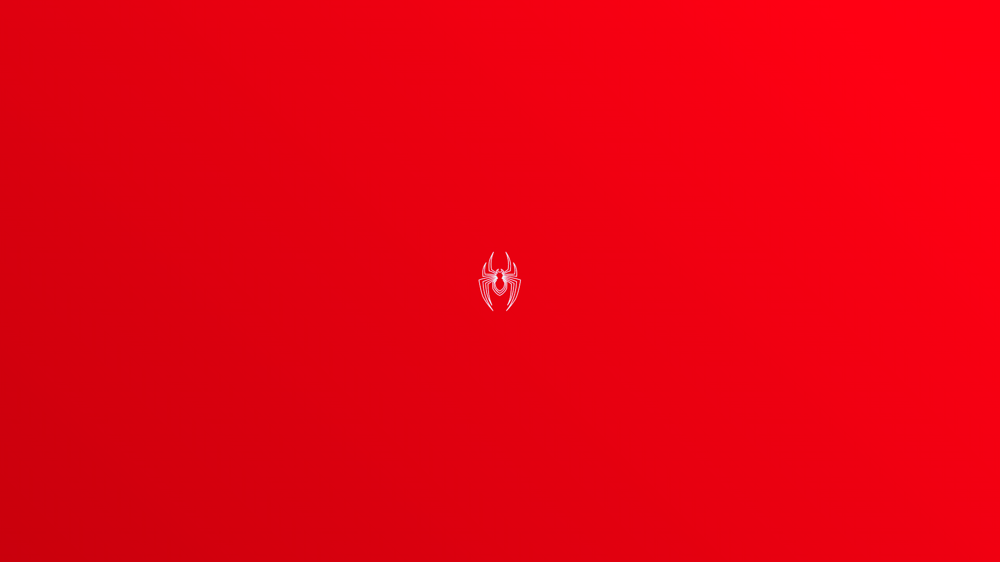

<div align="center" >
  
  
</div>

<!-- ==> ==> ==> ==> Badges <== <== <== <== -->

<p align="center">

       

  

  

  

</p>


<!-- ==> ==> ==> ==> Título <== <== <== <== -->

# :spider: FrontWeek | Projeto Spider-Man Miles Morales

<!-- ==> ==> ==> ==> Sobre o projeto <== <== <== <== -->

## :spider_web: Sobre o Projeto


<p> 
    Projeto de uma interface web do novo jogo do Homem-Aranha: Spiderman - Miles Morales, para Playstation 5.
</p>

<p>
    O website foi desenvolvido utilizando HTML, CSS com SASS e JavaScript, responsivo e com animações utilizando bibliotecas do JavaScript.
</p>


## :hammer_and_wrench: Tecnologias


### :books: Linguagens/Frameworks

* HTML
* CSS 
* SASS
* JavaScript
  
### :open_book: Bibliotecas

* [TiltJs](https://gijsroge.github.io/tilt.js/) - Biblioteca para aplicar o efeito parallax.  
* [TweenMax](https://greensock.com/docs/v2/TweenMax) - Biblioteca que contém a funcionalidade de execução em timeline.
* [SVG Inject](https://github.com/iconfu/svg-inject) - Biblioteca para injetar arquivos .svg. 
* [Google Fonts](https://fonts.google.com/) - Fontes utilizadas no projeto.

### :toolbox: Ferramentas

* [Figma](https://www.figma.com/) - Ferramenta de criação design de interfaces. 
* [Visual Studio Code](https://code.visualstudio.com/) - IDE de Desenvolvimento. 
* [Live Sass Compiler](https://marketplace.visualstudio.com/items?itemName=ritwickdey.live-sass) -  Extensão do VS Code para compilar o arquivo Sass e gerar style em css.


## 🖼️ Imagens do Projeto


<div align="center" >
  
</div>

</br>

<div align="center" >
  
</div>

##  Rodando o Projeto


```bash
# Clone este repositório
$ git clone https://github.com/Wesley-Elias/FrontWeek.git

# Acesse a pasta do projeto
$ cd FrontWeek

# execute o arquivo
index.html
```

## :thought_balloon: Inspiração


* [Násser Yousef Ali](https://www.nyousefali.com.br) - Semana FrontWeek


Feito com :heart: por [Wesley Elias](https://github.com/Wesley-Elias) 👋🏼
